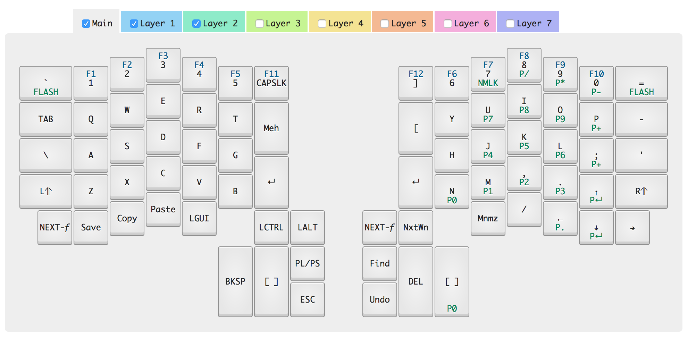

# Infinity ErgoDox layout and Kiibohd kll compiler
### Kiibohd firmware updated on 2017-02-14

Forked and customized from [hlship's project](https://github.com/hlship/ergodox-infinity-layout), which in turn was forked and customized from [fredZen's project](https://github.com/fredZen/ergodox-infinity-layout). As of Feb 2017 those projects use a year-old version of the Kiibohd firmware and don't explain customizing the LCD, which is why I made this repo.

My layout for the [Infinity ErgoDox](http://input.club/devices/infinity-ergodox) keyboard.

This is the basic layout:


 
My layout is fairly simple, with few layers and a focus on macros because I type more documents than code. In layer 2, '`' and '=' put the keyboard into flash mode.

Gradually, the above image may grow out of date as I continue to edit the KLL (Keyboard Layout Language) files.

The [KLL Spec](https://www.overleaf.com/read/zzqbdwqjfwwf) explains how to do more advanced customizations.

## Dependencies

This method of compiling the firmware with a custom layout requires [Docker](http://www.docker.com/).
The Docker image used by the compile script is available from
[Docker Hub](https://hub.docker.com/r/andybette/ergodox-infinity-firmware/) and is downloaded automatically as needed by the compile script.

To load layouts to the keyboard you need to install [dfu-util](https://github.com/kiibohd/controller/wiki/Loading-DFU-Firmware). For me, this was `brew install dfu-util`.

To convert a custom LCD image to the required format, you will need [Python 3](http://www.python.org/).

## Instructions

1. Edit the `ergodox-*.kll` files in the `kiibohd` folder of this repo to define your layout
2. When adding or removing a layer, change the value of PartialMaps in `kiibohd/ergodox.bash` accordingly
3. Run `make compile`
4. The compiled firmware is now available as files `kiibohd/left_kiibohd.dfu.bin` and `kiibohd/right_kiibohd.dfu.bin`
5. Flash the keyboard (see below)

### Changing the LCD image

1. Create a 128x32 monochrome bitmap with your desired image in the `LCDOverride` folder. Grayscale also works, but not well because the LCD is monochrome.
2. in that folder, run `python bitmap2Struct.py yourimage.bmp`
3. Copy `LCDOverride/lcdoverride.kll` to the `kiibohd` folder
4. In `kiibohd/ergodox.bash`, add the word `lcdoverride` to the string assigned to `DefaultMap`, separated by a space

### Flashing

It's enough to flash the master half of the keyboard (the one that's plugged into the host computer).
However, you might be surprised if you ever switch the master to the other half -- your layout is
determined by the firmware of the master half; keeping both halves in sync may spare you a lot
of confusion.

#### Flash the left half
1. Connect the left half of your keyboard to your computer
2. Put the keyboard into flash mode by pressing the button on the bottom of the PCB or using a key sequence that enables flashing.
3. Execute `make install` (example output below)

#### Flash the right half
4. Connect the right half of your keyboard to your computer
5. Put the keyboard into flash mode
6. Execute `make install-right`

```
18:56:59 ~/workspaces/github/ergodox-infinity-layout > make install
dfu-util -D kiibohd/left_kiibohd.dfu.bin
dfu-util 0.9

Copyright 2005-2009 Weston Schmidt, Harald Welte and OpenMoko Inc.
Copyright 2010-2016 Tormod Volden and Stefan Schmidt
This program is Free Software and has ABSOLUTELY NO WARRANTY
Please report bugs to http://sourceforge.net/p/dfu-util/tickets/

Match vendor ID from file: 1c11
Match product ID from file: b007
Opening DFU capable USB device...
ID 1c11:b007
Run-time device DFU version 0110
Claiming USB DFU Interface...
Setting Alternate Setting #0 ...
Determining device status: state = dfuIDLE, status = 0
dfuIDLE, continuing
DFU mode device DFU version 0110
Device returned transfer size 1024
Copying data from PC to DFU device
Download	[=========================] 100%        43432 bytes
Download done.
state(7) = dfuMANIFEST, status(0) = No error condition is present
dfu-util: unable to read DFU status after completion
18:58:47 ~/workspaces/github/ergodox-infinity-layout >
```

